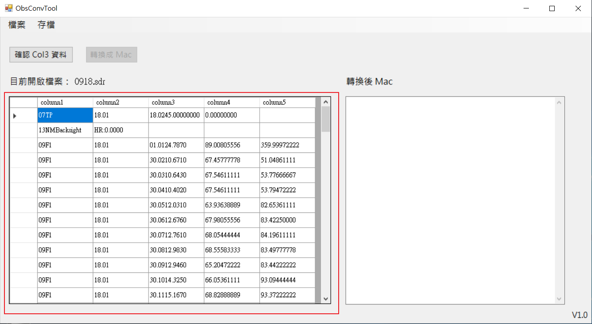
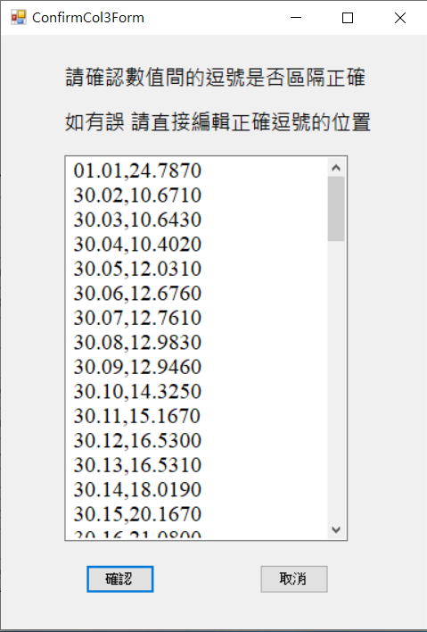
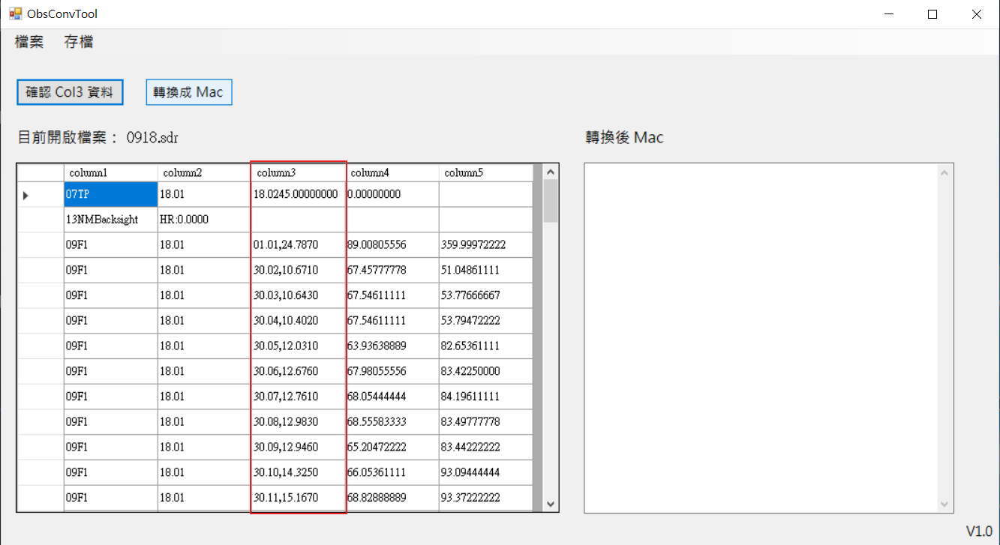
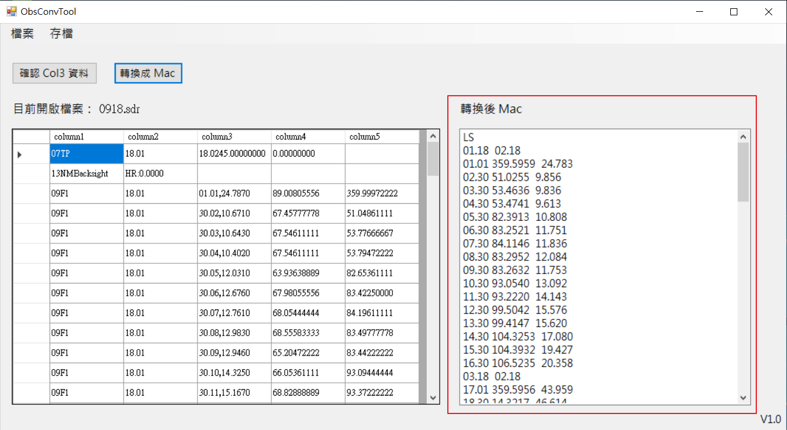

# 觀測檔轉換小工具 (ObsConvTool)
觀測檔(.sdr)利用公式計算轉換為相關的數據，並輸出為.mac檔
# 環境
開發環境為`Visual Studio` 
語言`C#`
# 文件
[0918.mac](doc/0918.mac "Title")
# 簡介
### 檔案讀取並整理.sdr檔，顯示在DataGridView

###  按下確認col3按鈕後，自動切割Col3欄位的數值，並讓使用者確認逗號是否有區隔正確

###  按下確定後，DataGridView Col3重新寫入

###  按下轉換成Mac按鈕，自動計算出相關數值

